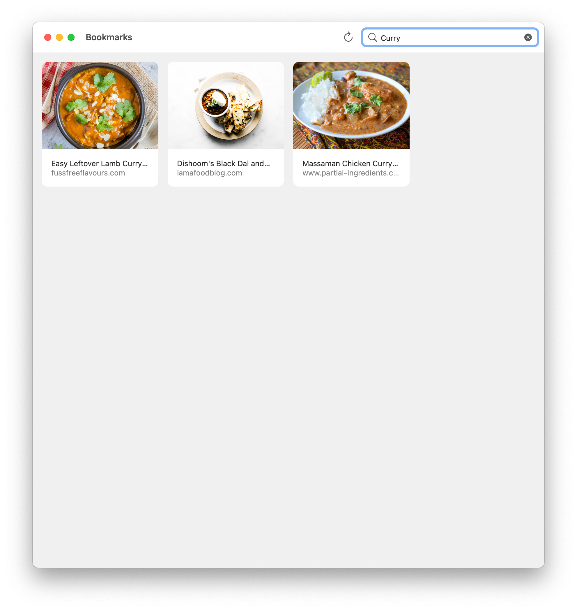

# Bookmarks

[](https://github.com/jbmorley/bookmarks/actions/workflows/build.yaml)

[Pinboard](https://pinboard.in) client for iOS and macOS.



## Development

### Managing Certificates

The build script (details below) uses Fastlane's match task to manage a certificates and a local keychain. Unfortunately, match seems very buggy when using Developer ID certificates, meaning it can't safely be used to fetch the certificates from Apple (it will keep creating new developer certificates until you reach your quota).

Instead, you can manually import a manually created certificate and private keychain into an existing match certificate store:

```bash
fastlane match import --skip_certificate_matching true --type developer_id
```

Match will ask for the path to your certificate (`.cer`) and private key file (`.p12`).

N.B. When manually importing certificates, match will not generate file names with identifiers so it's a good idea to name the certificate and private key with a matching, and obvious name.

### Builds

In order to make continuous integration easy the `scripts/build.sh` script builds the full project, including submitting the macOS app for notarization. In order to run this script (noting that you probably don't want to use it for regular development cycles), you'll need to configure your environment accordingly, by setting the following environment variables:

- `MATCH_PASSWORD` -- the password/passphrase to secure the [match](https://docs.fastlane.tools/actions/match/) certificate store
- `CERTIFICATE_REPOSITORY` -- the repository used for the match certificate store (must be HTTPS)
- `CERTIFICATE_REPOSITORY_AUTHORIZATION_KEY` -- a GitHub authorization key used to access the certificate repository (see the [match authorization docs](https://docs.fastlane.tools/actions/match/#git-storage-on-github))
- `APPLE_DEVELOPER_ID` -- individual Apple Developer Account ID (used for notarization)
- `FASTLANE_APPLE_APPLICATION_SPECIFIC_PASSWORD` -- [app-specific password](https://support.apple.com/en-us/HT204397) for the Developer Account
- `NOTARIZE` -- boolean indicating whether to attempt notarize the build (conditionally set based on the current branch using `${{ github.ref == 'refs/heads/main' }}`)
- `TRY_RELEASE` -- boolean indicating whether to attempt a release (conditionally set based on the current branch using `${{ github.ref == 'refs/heads/main' }}`)
- `GITHUB_TOKEN` -- [GitHub token](https://docs.github.com/en/github/authenticating-to-github/creating-a-personal-access-token) used to create the release

The script (like Fastlane) will look for and source an environment file in the Fastlane directory (`Fastlane/.env`) which you can add your local details to. This file is, of course, in `.gitignore`. For example,

```bash
# Certificate store
export MATCH_PASSWORD=
export CERTIFICATE_REPOSITORY=
export CERTIFICATE_REPOSITORY_AUTHORIZATION_KEY=

# Developer account
export APPLE_DEVELOPER_ID=
export FASTLANE_APPLE_APPLICATION_SPECIFIC_PASSWORD=

# GitHub (only required if publishing releases locally)
export GITHUB_TOKEN=
```

You can generate your GitHub authorization key (for `CERTIFICATE_REPOSITORY_AUTHORIZATION_KEY`) as follows:

```bash
echo -n your_github_username:your_personal_access_token | base64
```

Once you've added your environment variables to this, run the script from the root of the project directory as follows:

```bash
./scripts/build.sh
```

You can notarize local builds by specifying the `--notarize` parameter:

```bash
./scripts/build.sh --notarize
```

You can publish a build locally by specifying the `--release` parameter:

```bash
./scripts/build.sh --release
```

### Test Plans

- [macOS](documentation/test-plans/macos.markdown)

## Licensing

Bookmarks is licensed under the MIT License (see [LICENSE](LICENSE)).

During development, the plan is to make builds available for free through the [Releases](https://github.com/jbmorley/bookmarks/releases) section of the GitHub project. Once we reach something robust and ready for release, we'll make a paid version available through the [App Store](https://www.apple.com/app-store/) to fund on-going costs of development. The app will remain Open Source, and anyone is free to contribute or build their own copies, and we'll figure out a way to give free licenses to contributors.
