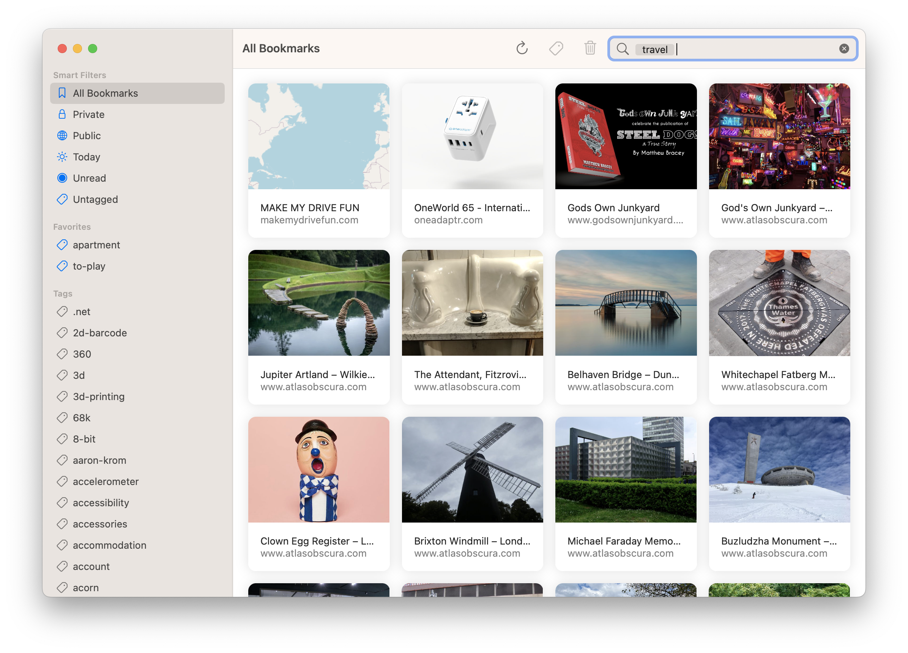

# Bookmarks

[Pinboard](https://pinboard.in) client for iOS and macOS.

## Development

Bookmarks follows the version numbering, build and signing conventions for InSeven Limited apps. Further details can be found [here](https://github.com/inseven/build-documentation).

Use the `Bookmarks.xcworkspace` workspace with the Xcode GUI for local builds. Both the iOS and macOS debug builds are configured to use a local development account for signing. Release builds are configured for building under Continuous Integration via the 'scripts/build.sh' build script. These are run using GitHub Actions which ensures the correct environment variables are defined.

## Licensing

Bookmarks is licensed under the MIT License (see [LICENSE](LICENSE)).
